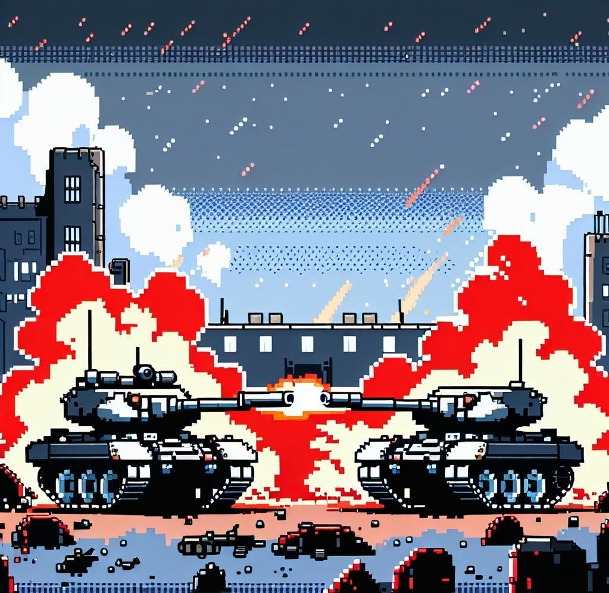

# Tank Strife 坦克纷争

[English](#english) | [中文](README_cn.md)

### Project Description
Tank Strife is a 2D tank battle game developed using Pygame. This project is primarily created for learning purposes, aiming to improve programming skills and game development knowledge.

### Learning Objectives
- Understand the basics of game development with Pygame
- Practice object-oriented programming in Python
- Learn about game physics and collision detection
- Explore AI implementation for computer-controlled opponents
- Gain experience in developing user interfaces for games
- Study the fundamentals of multiplayer game networking (in later versions)

### Features (Planned)
- Single-player mode against AI opponents
- Local multiplayer mode for two players
- Various tank types with different attributes
- Destructible environment elements
- Power-ups and special abilities
- Multiple game modes (e.g., deathmatch, capture the flag)
- Basic networking for online multiplayer (future version)

### Development Plan

- [Development Plan](DevelopmentPlan.md)
- [开发计划 (中文)](DevelopmentPlan_cn.md)

### Installation
(Instructions will be added as the project progresses)

### How to Contribute
As this is a learning project, contributions, suggestions, and feedback are welcome. Please feel free to open issues or submit pull requests.

### License
This project is open source and available under the [MIT License](LICENSE).

### Change Log
- [Change Log](CHANGELOG.md)

### Show

Version 0.3

